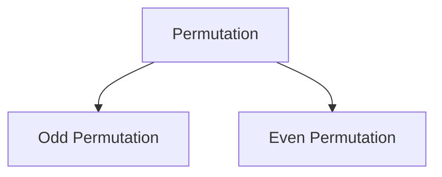

### Permutation

A permutation is an arrangement of objects in a specific order. 

#### Types of Permutations

#### Odd Permutation
 - if number of swap is odd then it is called odd permutation.
#### Even Permutation
 - if number of swap is even then it is called even permutation. 

### Transposition 
 - A transposition is a permutation that swaps two elements while keeping the rest unchanged.

